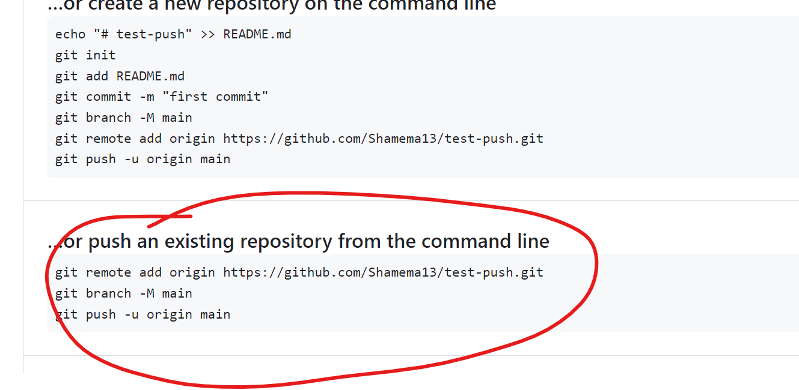

## step 1
- open terminal and type `git init`

## step 2
- `git add .`

## step 3
- `git commit -m "message"`

## step 4
- create a new repository without readme in github

## step 5
- 
- copy the highlighted code from github

## step 6
- paste in terminal

## step 7
- refresh the github to see the content
